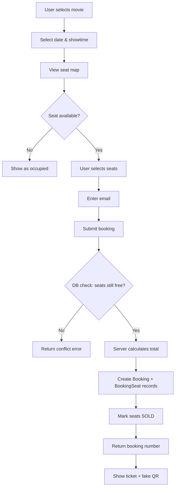
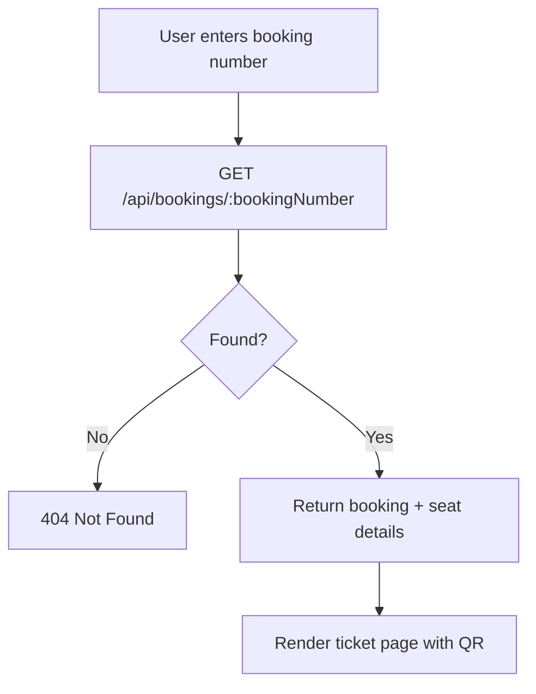
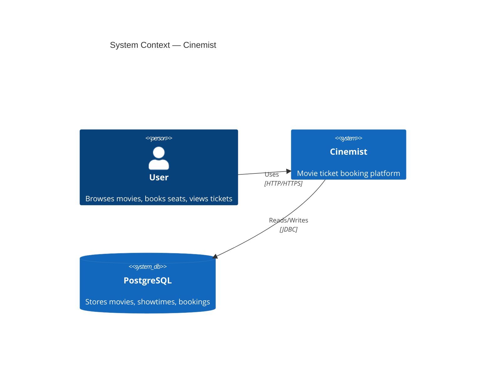
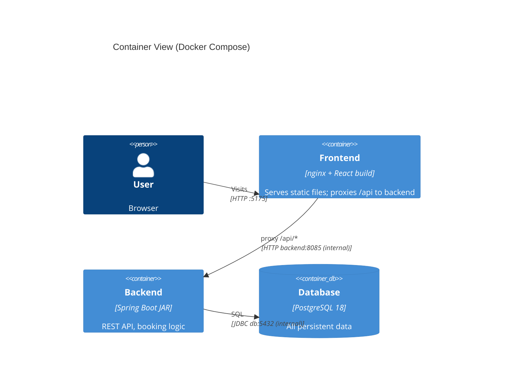
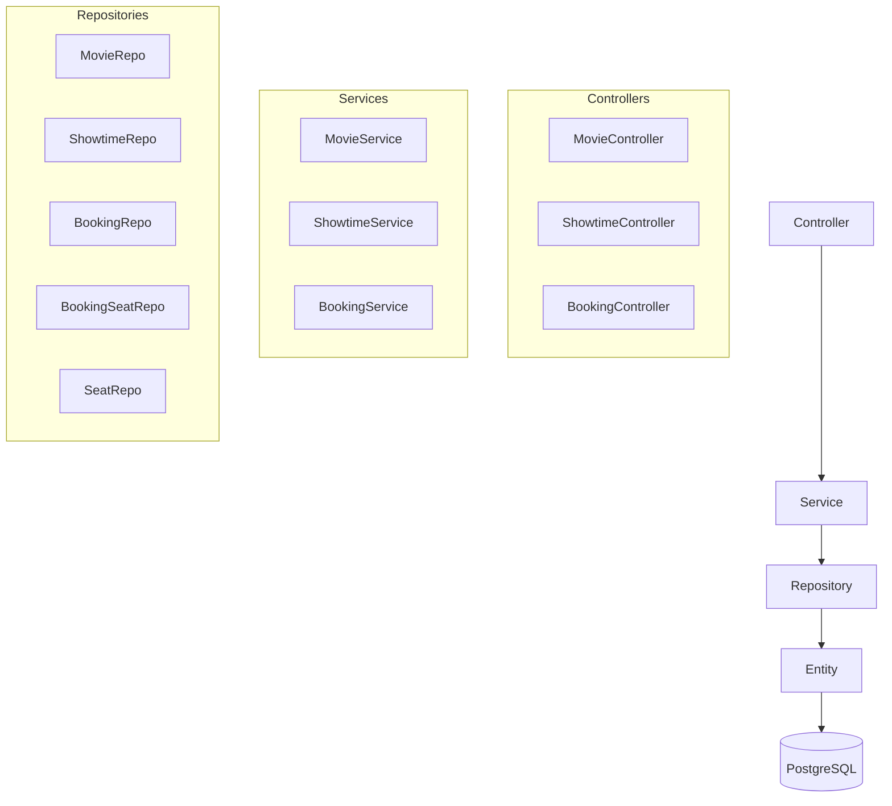
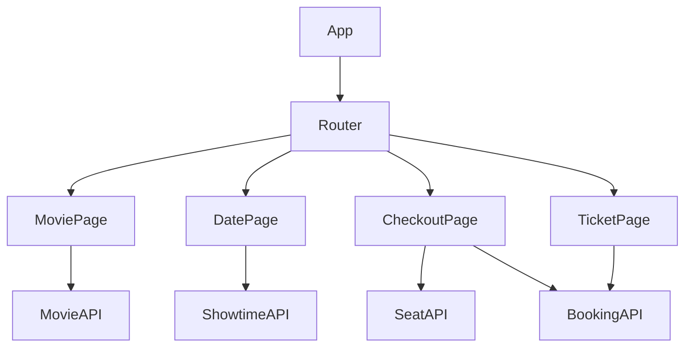
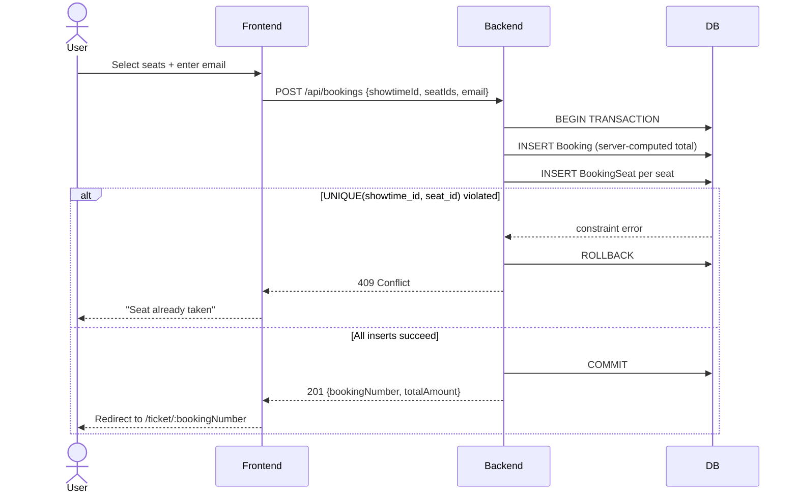
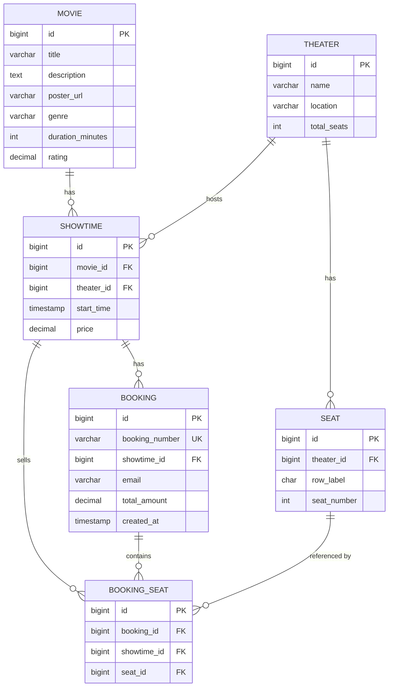
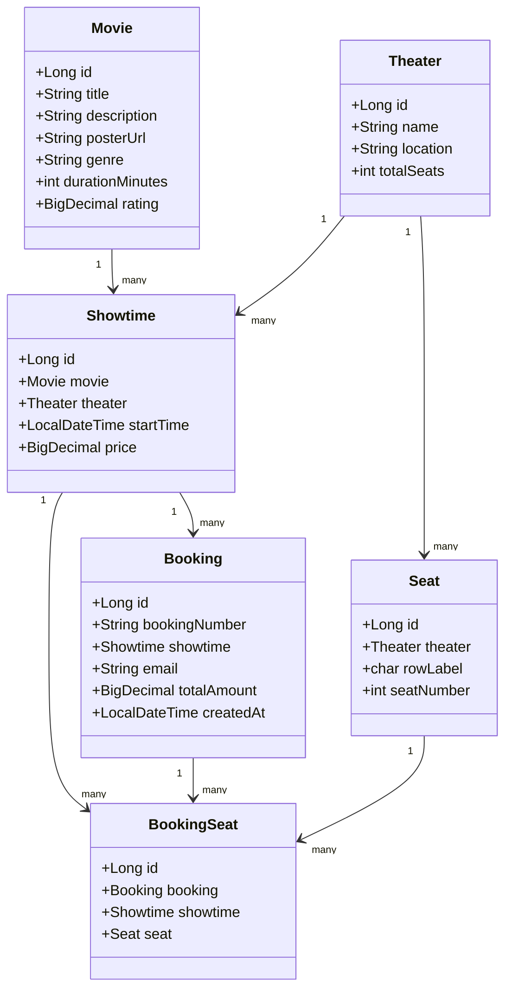

# System Specification — Cinemist Movie Ticket Booking

## 1. Architecture & Technology Selection

| Layer | Technology | Reason |
|-------|-----------|--------|
| Backend | Java 17 + Spring Boot 3.x | LTS, mature ecosystem, JPA integration |
| Frontend | React + Vite | Fast HMR, component-based UI |
| Database | PostgreSQL 18 (Docker) | ACID transactions, seat concurrency safety |
| ORM | Spring Data JPA (Hibernate) | Entity mapping, query abstraction |
| Build | Maven (backend) / npm (frontend) | Standard toolchain |
| Container | Docker Compose | Local dev parity |

---

## 2. Data Model

| Entity | Key Fields |
|--------|-----------|
| `Movie` | id, title, description, posterUrl, genre, duration, rating |
| `Theater` | id, name, location, totalSeats |
| `Seat` | id, theaterId, rowLabel, seatNumber |
| `Showtime` | id, movieId, theaterId, startTime, price |
| `Booking` | id, bookingNumber, showtimeId, email, totalAmount, createdAt |
| `BookingSeat` | id, bookingId, showtimeId, seatId — unique(showtimeId, seatId) |

### 2.1 Initial Movie Data (from `movieinfo_neon.html`)

Seed data in `data.sql` must use the following movies exactly:

| Title | Genre | Rating | Poster |
|-------|-------|--------|--------|
| NEON RISING | Sci-Fi / Action | 9.2 | `https://lh3.googleusercontent.com/aida-public/AB6AXuC6o0Yz_xmN9X3G...` |
| THE GATEWAY | Sci-Fi / Thriller | 8.7 | `https://lh3.googleusercontent.com/aida-public/AB6AXuDXSvPq2gFXjzwY...` |
| VOID RUNNERS | Action / Space | 8.2 | `https://lh3.googleusercontent.com/aida-public/AB6AXuBKumN51JDLgQXH...` |
| SYNAPTIC | Thriller / Drama | 9.0 | `https://lh3.googleusercontent.com/aida-public/AB6AXuCG542Y9ctBruPN...` |
| KINETIC EDGE | Action / Cyberpunk | 7.9 | `https://lh3.googleusercontent.com/aida-public/AB6AXuDmvvOtfQmm8Atc...` |

> Full image URLs are in `design/movieinfo_neon.html`. Do not alter or proxy them.

---

## 3. Key Flows

### 3.1 Seat Booking Flow



### 3.2 Order Lookup Flow



---

## 4. Pseudocode

### POST /api/bookings

A booking_seat row existing for (showtimeId, seatId) means that seat is sold.
Double-booking is prevented by a UNIQUE(showtime_id, seat_id) DB constraint —
the database rejects the duplicate even under concurrent first-time inserts,
which a SELECT FOR UPDATE on not-yet-existing rows cannot.

```
function createBooking(showtimeId, seatIds[], email):
  showtime = findShowtime(showtimeId)          // 404 if missing
  totalAmount = showtime.price * seatIds.length
  bookingNumber = generateBookingNumber()      // see api.md: CNM-YYYYMMDD-XXXX

  BEGIN TRANSACTION
    booking = insert Booking(bookingNumber, showtimeId, email, totalAmount)
    try:
      for each seatId in seatIds:
        insert BookingSeat(booking.id, showtimeId, seatId)
    catch UniqueConstraintViolation:
      ROLLBACK
      throw ConflictException("Seat already taken")
  COMMIT

  return booking
```

---

## 5. System Context Diagram



---

## 6. Container / Deployment Overview

All three services are orchestrated by Docker Compose.
The browser only talks to nginx (port 5175); nginx proxies `/api/*` to the backend container internally — no CORS needed.



### Port mapping
| Service | Container port | Host port |
|---------|---------------|-----------|
| nginx (frontend) | 80 | **5175** |
| Spring Boot (backend) | 8085 | 8085 (optional, for direct dev access) |
| PostgreSQL | 5432 | 5432 (optional, for DB tools) |

### Dev vs Docker
| Mode | Frontend | API calls |
|------|----------|-----------|
| `npm run dev` | Vite :5175, proxy `/api` → `localhost:8085` | Vite proxy |
| `docker compose up` | nginx :5175, proxy `/api` → `backend:8085` | nginx proxy |

Same frontend code works in both modes (relative `/api/...` URLs).

---

## 7. Module Relationship

### Backend



### Frontend



---

## 8. Sequence Diagram

### Seat Booking



---

## 9. ER Diagram



> `BOOKING_SEAT` carries `showtime_id` (denormalized from `BOOKING`) so a
> `UNIQUE(showtime_id, seat_id)` constraint can enforce one-sale-per-seat at the
> DB level. A row's existence means the seat is sold; there is no status column.

---

## 10. Class Diagram


