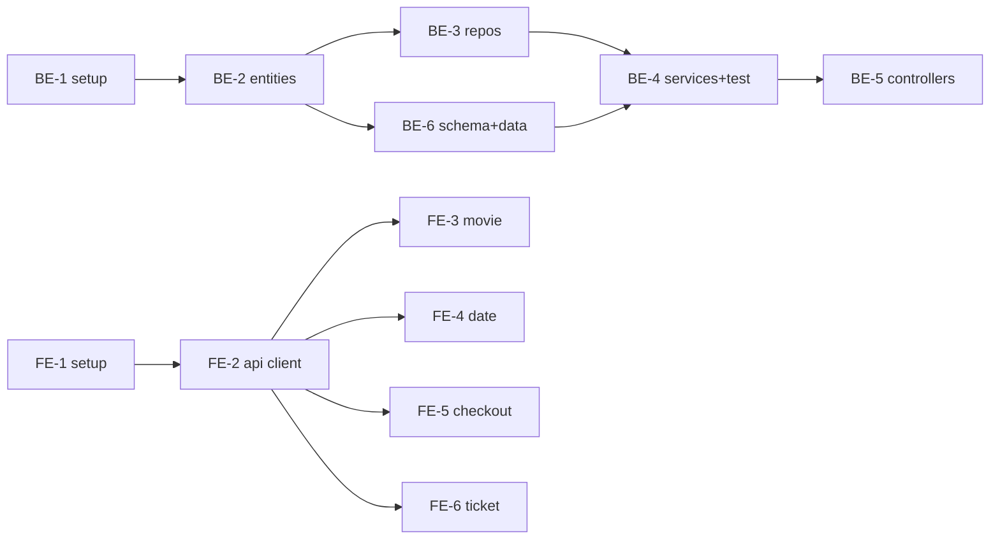

# Cinemist — Task List

> 並行開發用 subagent，依「Wave」分批派發：同一 Wave 內的任務彼此獨立、可同時進行；
> 跨 Wave 必須等前一波完成。詳見底部「Parallel Execution Plan」。

## Documentation & Planning（已完成）

由 `prd.md` 衍生的文件與規劃，皆已完成並確認：

| # | 產出 | 內容 | Status |
|---|------|------|--------|
| DOC-0 | [prd.md](prd.md) | 需求來源（開發者撰寫，9 項功能 + UI 參考） | ✅ source |
| DOC-1 | [spec.md](spec.md) | 規格書 10 章（架構、資料模型、流程、虛擬碼、C4、ER、序列、類別圖；UNIQUE 約束防雙重購買） | ✅ done |
| DOC-2 | [api.md](api.md) | RESTful API 文件（6 端點，前端 :5175 / 後端 :8085，CNM 訂單編號，409 衝突） | ✅ done |
| DOC-3 | [todolist.md](todolist.md) | 任務拆分 + 依賴 + 並行波次（本檔） | ✅ done |
| DOC-4 | [docs/superpowers/plans/2026-06-21-cinemist-booking.md](docs/superpowers/plans/2026-06-21-cinemist-booking.md) | 實作計畫（13 任務逐步、完整程式碼、驗證指令） | ✅ done |
| DOC-5 | [.project-memory/architecture.md](.project-memory/architecture.md) | 專案記憶：架構、設計系統、品牌 Cinemist | ✅ done |
| DOC-6 | superpowers:brainstorming review | 缺口確認：port、UNIQUE 約束、訂單編號格式、品牌名 — 全數修正 | ✅ done |

> 實作計畫（含每任務完整程式碼與驗證步驟）：DOC-4。

## Backend

| # | Task | Depends on | Wave | Status |
|---|------|-----------|------|--------|
| BE-1 | Project setup: Spring Boot + Maven + dependencies + Docker Compose | — | 1 | ✅ done |
| BE-2 | Entity classes: Movie, Theater, Seat, Showtime, Booking, BookingSeat | BE-1 | 2 | ✅ done |
| BE-7 | ~~CORS config~~ — 移除，nginx 統一代理消除跨域問題 | — | — | ✅ N/A |
| BE-8 | Backend Dockerfile (multi-stage: maven build → JRE runtime) | BE-1 | 2 | ✅ done |
| BE-3 | Repository layer: JPA repositories for all entities | BE-2 | 3 | ✅ done |
| BE-6 | schema.sql + data.sql: tables (UNIQUE) + seed | BE-2 | 3 | ✅ done |
| BE-4 | Service layer + concurrency test | BE-3, BE-6 | 4 | ✅ done |
| BE-5 | Controller layer + global exception handler | BE-4 | 5 | ✅ done |

## Frontend

| # | Task | Depends on | Wave | Status |
|---|------|-----------|------|--------|
| FE-1 | Project setup: React + Vite, port 5175 + router | — | 1 | ✅ done |
| FE-2 | API client layer: axios + api.md endpoints | FE-1 | 2 | ✅ done |
| FE-7 | Frontend Dockerfile (multi-stage: npm build → nginx) + nginx.conf | FE-1 | 2 | ✅ done |
| FE-3 | Movie list page (ref: movieinfo_neon.html) | FE-2 | 3 | ✅ done |
| FE-4 | Date & showtime selection page (ref: date_neon.html) | FE-2 | 3 | ✅ done |
| FE-5 | Seat selection + checkout page (ref: checkout_neon.html) | FE-2 | 3 | ✅ done |
| FE-6 | Ticket confirmation page with fake QR (ref: ticket_neon.html) | FE-2 | 3 | ✅ done |

## Bug Fixes

| # | Issue | Status |
|---|-------|--------|
| BUG-1 | `package.json` 缺少 `react-router-dom` + `axios`，docker build 失敗 | ✅ fixed |
| BUG-2 | WebGL hero 動畫黑屏：根本原因為 `useEffect([], [])` 在 `hero=null` 時 canvas 不在 DOM，effect 提早結束。修正：依賴改為 `[hero]`，同時還原原始設計 WebGL shader（與 `design/movieinfo_neon.html` 相同）。 | ✅ fixed |
| BUG-3 | **根本原因：Tailwind 用 CDN，無法裝第三方 plugin（tailwindcss-animate）**，導致設計稿所有 `animate-in / fade-in / slide-in-from-bottom-*` 動畫全部失效。已改為 npm 安裝：`tailwind.config.js` + `postcss.config.js` 建立，`src/index.css` 改為 `@tailwind` directives，`index.html` CDN 移除。 | ✅ fixed |
| BUG-001 | 電影圖片錯亂：首頁電影卡片圖片與原設計稿（`Design/movieinfo_neon.html`）不符，需對照原設計確認各電影 `posterUrl` 對應圖片正確性並修正 | ⬜ pending |

## Feature Requests

| # | Feature | Status |
|---|---------|--------|
| FEAT-001 | 電影卡片點擊導航：「RECOMMENDED FOR YOU」區塊點選電影卡片，直接導向該電影日期選擇頁（`/movies/:id/dates`），帶入 `movieId` | ✅ fixed |

## Integration

| # | Task | Status |
|---|------|--------|
| INT-1 | `docker compose up --build` 全流程驗證（5 部電影 → 選場次 → 選座 → 結帳 → QR ticket） | 🔄 in progress |

## UI Polish — 對照設計稿修正

> 分析來源：對照 `design/*_neon.html` 與現行 React 實作的差距。

### MoviePage（movieinfo_neon.html）

| # | 問題 | Status |
|---|------|--------|
| UI-1 | 缺少「THE CREW」演員卡區塊（4 人 grid，grayscale → hover 彩色） | ✅ done |
| UI-2 | Sticky sidebar 缺少 Trailer Preview 卡片（圖片 + play 按鈕覆蓋層） | ✅ done |
| UI-3 | Footer 需改為 3 欄（品牌說明 / SOCIAL+LOCATIONS 連結 / newsletter 表單） | ✅ done |
| UI-4 | Hero 內容文字缺少 entry animation（`animate-fade-in-up`） | ✅ done |

### DatePage（date_neon.html）

| # | 問題 | Status |
|---|------|--------|
| UI-5 | 電影海報周圍缺少漸層光暈邊框（`absolute -inset-1 bg-gradient-to-tr … blur group-hover:opacity-60`） | ✅ done |
| UI-6 | 影廳卡背景缺少大圖示裝飾（`material-symbols-outlined text-[120px]` opacity-10 → opacity-30 on hover） | ✅ done |
| UI-7 | `digital-pulse` 效果應為 shimmer sweep 光掃（`::after` 偽元素左→右滑過），目前是 box-shadow pulse | ✅ done |
| UI-8 | 日期 Tab 捲動列缺少 `mask-fade-right` 右側漸層遮罩 | ✅ done |
| UI-9 | 影廳卡缺少 `glass-panel-hover` hover 效果（cyan border + glow box-shadow） | ✅ done |
| UI-10 | 電影 header 區塊缺少 slide-in entry animation（`animate-in fade-in slide-in-from-bottom-8 duration-700`） | ✅ done |

### CheckoutPage（checkout_neon.html）

| # | 問題 | Status |
|---|------|--------|
| UI-11 | 座位圖容器原設計使用 `aspect-[16/10]`，目前無固定比例導致高度跑版 | ✅ done |
| UI-12 | Checkout 按鈕選座後應套用 `active-glow`（cyan box-shadow pulse），目前缺失 | ✅ done |

## E2E Testing（Playwright）

| # | Task | Status |
|---|------|--------|
| E2E-1 | 安裝 Playwright + 設定 playwright.config.ts（baseURL: http://localhost:5175） | ⬜ pending |
| E2E-2 | 測試：電影列表頁載入（5 部電影顯示、點擊導向日期頁） | ⬜ pending |
| E2E-3 | 測試：日期選擇頁（切換日期 tab、選場次、footer 出現、跳轉座位頁） | ⬜ pending |
| E2E-4 | 測試：選擇座位選兩個 + 結帳（選座、填 email、送出、跳轉 ticket 頁） | ⬜ pending |
| E2E-5 | 測試：Ticket 頁（訂單號、QR、場次 / 座位資訊正確） | ⬜ pending |
| E2E-6 | 測試：409 衝突（同一座位重複購買，顯示錯誤訊息） | ⬜ pending |

## Dependency Graph

## Status Legend
- ⬜ pending
- 🔄 in progress
- ✅ completed / done
